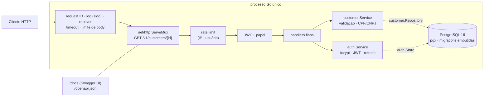

# go-customers-api

[](https://github.com/andreccls/go-customers-api/actions/workflows/ci.yml)
[](https://go.dev/)
[](https://www.postgresql.org/)
[](LICENSE)
[](#cobertura)

> ⚠️ **PROJETO DE EXEMPLO DE CÓDIGO (reference / sample) — NÃO É UM PRODUTO PRONTO PARA PRODUÇÃO.**
> Existe para demonstrar **uma API enxuta e idiomática em Go** (CRUD, autenticação JWT, OpenAPI, testes) e a documentação
> que a acompanha. Os segredos e senhas do `docker-compose.yml`/`.env.example` são **apenas de desenvolvimento**. Não o
> publique na internet como está. A lista honesta do que falta está em [Limitações conhecidas](#limitações-conhecidas-e-próximos-passos).

> 🇬🇧 Short English summary at the [end of this file](#english-summary) (and in [README.en.md](README.en.md)).

API de **gestão de clientes** em **Go 1.24 + PostgreSQL 16**, só com a biblioteca padrão (`net/http`, `log/slog`,
`encoding/json`) e **4 dependências diretas** (pgx, golang-jwt, bcrypt, uuid): cadastro, consulta por id, listagem com
paginação/filtro/busca, atualização completa (`PUT`) e parcial (`PATCH`), remoção, **autenticação JWT com refresh rotativo**,
papéis (`admin`/`user`), rate limiting, erros **RFC 9457** e **OpenAPI + Swagger UI embutidos** (sem CDN) que não saem de sincronia
com o código — há um teste que falha se divergirem.

Serve de **template**: o passo a passo para adicionar um recurso está em
[docs/ARCHITECTURE.md](docs/ARCHITECTURE.md#4-como-adicionar-um-recurso-passo-a-passo).
Desenhado com **SOLID idiomático, KISS e YAGNI** — por isso **não** tem framework web, ORM, camada "use case", repositório
genérico nem injeção de dependência por container; cada escolha está num [ADR](docs/adr).

## Arquitetura



As interfaces (`customer.Repository`, `auth.Store`, `httpapi.CustomerService`…) são declaradas **no pacote que as consome**;
`customer` e `auth` não conhecem HTTP nem SQL. Detalhes, fluxo de uma requisição e tabela de erros em
[docs/ARCHITECTURE.md](docs/ARCHITECTURE.md).

## Estrutura de pastas

```
.
├── cmd/api/main.go                 # flags, sinais, os.Exit — nada de lógica
├── internal/
│   ├── app/                        # composition root + Serve (graceful shutdown) + Healthcheck
│   ├── config/                     # env vars → Config; recusa segredo fraco em release
│   ├── customer/                   # modelo, validação (CPF/CNPJ), Service, Repository
│   ├── auth/                       # usuários, bcrypt, JWT, refresh rotativo, Store
│   ├── httpapi/                    # rotas, middleware, RFC 9457, openapi.json, swagger/ (embutidos)
│   ├── postgres/                   # pgx + migrations/*.sql embutidas
│   ├── memstore/ repotest/ testdb/ # fakes em memória · suíte de contrato · schema isolado por teste
│   ├── ratelimit/ validation/      # token bucket · erros de campo, e-mail
├── docs/ (ARCHITECTURE.md, adr/)   scripts/ (demo.sh, coverage-gate.sh)
└── Dockerfile  docker-compose.yml  Makefile  .env.example  .github/workflows/ci.yml
```

## Como rodar

Pré-requisito: **Docker** + `make` (e `curl`/`jq` para o demo). **Não precisa de Go no host** — tudo roda em contêineres.

```bash
make up      # PostgreSQL 16 + API (distroless, não-root)  ->  http://localhost:8094   (Swagger UI: /docs/)
make demo    # passeio completo com curl (scripts/demo.sh)
make down    # para tudo (mantém o volume do banco)
```

Portas de host (em `127.0.0.1`, configuráveis via `.env`): API **8094**, PostgreSQL **5436**. Para mudar, copie `.env.example`
para `.env`. O usuário admin de desenvolvimento (`admin@example.com` / `dev-only-admin-password`) é criado na partida a partir de
`ADMIN_EMAIL`/`ADMIN_PASSWORD`.

### Configuração (variáveis de ambiente)

| Variável | Padrão | Descrição |
|---|---|---|
| `APP_ENV` | `release` | `release` (padrão, **estrito**) ou `development`. Em `release` a API **recusa subir** com `JWT_SECRET` < 32 caracteres, de baixa entropia ou parecido com placeholder (`dev-only`, `change-me`…), e com `ADMIN_PASSWORD` fraca |
| `DATABASE_URL` | — (obrigatória) | URL do PostgreSQL |
| `JWT_SECRET` | — (obrigatória) | segredo HS256; **só por env**, nunca no repositório (`openssl rand -base64 48`) |
| `HTTP_ADDR` | `:8080` | endereço de escuta |
| `JWT_ACCESS_TTL` / `JWT_REFRESH_TTL` | `15m` / `168h` | validade dos tokens |
| `RATE_LIMIT_AUTH_PER_MIN` / `RATE_LIMIT_API_PER_MIN` | `10` / `120` | por IP em `/v1/auth/*`; por usuário no resto |
| `ADMIN_EMAIL` / `ADMIN_PASSWORD` | — | cria o admin inicial (idempotente); precisam vir juntos |
| `LOG_LEVEL` | `info` | `debug` · `info` · `warn` · `error` |

### Evidência: a stack real por curl (saída do `make demo`, resumida)

Executado em 2026-10-06 contra a stack de `make up` (imagem distroless + PostgreSQL 16):

```text
== docs
200  GET /docs/ (Swagger UI)        200  GET /openapi.json        200  GET /readyz
== auth
201  register user                  409  register same e-mail again       422  register invalid
200  login user                     200  refresh (rotation)
401  refresh with the OLD token again (family revoked)
== authorization
401  GET /v1/customers without token   {"code":"missing_token", ...}
401  GET /v1/customers with garbage token
== customers CRUD
201  POST create Ana (x3)           409  POST duplicate e-mail  {"code":"email_taken"}
409  POST duplicate document        {"code":"document_taken"}
422  POST invalid body              {"code":"validation_failed","errors":[{"field":"name",...},{"field":"email",...},{"field":"document",...}]}
400  POST malformed JSON            {"code":"invalid_json"}
200  GET by id        404  GET unknown id        200  PUT full update        200  PATCH {"phone":"31 3333-4444","status":"inactive"}
== list: pagination, filter, search
200  ?page_size=2&page=1  {"page":1,"page_size":2,"total":3,"names":["Carla Dias","Bruno Lima"]}
200  ?page_size=2&page=2  {"page":2,"page_size":2,"total":3,"names":["Ana Souza Costa"]}
200  ?status=inactive&q=<sufixo>   {"total":2,...}          200  ?q=bruno<sufixo>   {"total":1,...}
422  ?page_size=1000      {"code":"validation_failed","errors":[{"field":"page_size","message":"must be between 1 and 100"}]}
== roles
403  DELETE as plain user           204  DELETE as admin (x3)            404  GET after delete
== rate limit (10/min por IP em /v1/auth/*)
401 401 401 429 429 429 ...        HTTP/1.1 429   Content-Type: application/problem+json   Retry-After: 5
```

Também verificados à mão: com `APP_ENV` não definido e o segredo de desenvolvimento, o contêiner **sai com código 1** listando
`JWT_SECRET is too weak for release mode` e `ADMIN_PASSWORD is too weak…`; com um segredo forte sobe em modo `release`; `docker stop`
(SIGTERM) loga `shutting down` e sai com código 0; `/docs/` carrega o Swagger UI no navegador sem erros no console (CSP `default-src 'self'`).

Fluxo mínimo à mão:

```bash
API=http://localhost:8094; H='Content-Type: application/json'
curl -s -H "$H" $API/v1/auth/register -d '{"email":"eu@example.com","password":"uma-senha-longa"}'
TOKEN=$(curl -s -H "$H" $API/v1/auth/login -d '{"email":"eu@example.com","password":"uma-senha-longa"}' | jq -r .access_token)
curl -s -H "Authorization: Bearer $TOKEN" -H "$H" $API/v1/customers -d '{
  "name":"Maria Silva","email":"maria@example.com","document":"529.982.247-25","phone":"(31) 99999-0000",
  "address":{"street":"Rua das Flores","number":"100","city":"Belo Horizonte","state":"MG","zip_code":"30130-000"}}'
curl -s -H "Authorization: Bearer $TOKEN" "$API/v1/customers?q=maria&status=active&page=1&page_size=20"
```

## Endpoints

Contrato completo (esquemas, exemplos, respostas) no Swagger UI em `/docs/` e em [`internal/httpapi/openapi.json`](internal/httpapi/openapi.json).

| Método e rota | Acesso | Descrição | Respostas |
|---|---|---|---|
| `POST /v1/auth/register` | público · rate limit/IP | Cria usuário (papel `user`) | 201 · 400 · 409 · 422 · 429 |
| `POST /v1/auth/login` | público · rate limit/IP | Devolve `access_token` (JWT, 15 min) + `refresh_token` | 200 · 401 · 429 |
| `POST /v1/auth/refresh` | público · rate limit/IP | Rotaciona o refresh token (uso único; reuso revoga a família) | 200 · 401 · 429 |
| `POST /v1/auth/logout` | público · rate limit/IP | Revoga um refresh token | 204 · 429 |
| `POST /v1/customers` | `user` ou `admin` | Cria cliente (e-mail e documento únicos) | 201 · 400 · 401 · 409 · 422 |
| `GET /v1/customers?page=&page_size=&status=&q=` | `user` ou `admin` | Lista paginada, mais novos primeiro, `total`; `q` busca em nome/e-mail/documento | 200 · 401 · 422 |
| `GET /v1/customers/{id}` | `user` ou `admin` | Consulta | 200 · 401 · 404 |
| `PUT /v1/customers/{id}` | `user` ou `admin` | Substitui todos os campos | 200 · 400 · 401 · 404 · 409 · 422 |
| `PATCH /v1/customers/{id}` | `user` ou `admin` | Atualiza só os campos enviados | 200 · 400 · 401 · 404 · 409 · 422 |
| `DELETE /v1/customers/{id}` | **só `admin`** | Remove definitivamente ([ADR 0003](docs/adr/0003-hard-delete-and-offset-pagination.md)) | 204 · 401 · 403 · 404 |
| `GET /healthz` · `GET /readyz` | público | Liveness · readiness (consulta o banco) | 200 · 503 |
| `GET /docs/` · `GET /openapi.json` | público | Swagger UI e especificação (embutidos no binário) | 200 |

Todo `4xx/5xx` é `application/problem+json` (RFC 9457) com `code` estável e `request_id`; `422` traz `errors: [{field, message}]`.
Todas as respostas levam `X-Request-ID`. `429` leva `Retry-After`.

### Regras do cliente

- **Documento:** CPF (11 dígitos) ou CNPJ (14) com **dígitos verificadores validados**; aceita pontuação, guarda só dígitos; único.
- **E-mail:** único, guardado em minúsculas. **Telefone** (opcional): 10–13 dígitos. **Endereço** (opcional, tudo-ou-nada): rua, número,
  cidade, UF (2 letras) e CEP (8 dígitos). **Status:** `active` (padrão) ou `inactive`.
- **Paginação:** offset (`page` ≥ 1, `page_size` 1–100, padrão 20), ordem estável `created_at DESC, id DESC`.

## Testes

```bash
make test        # TUDO com -race: unitários + integração com PostgreSQL real (sobe sozinho) + gates de cobertura
make test-unit   # só o que não precisa de banco (testes de integração são pulados), com -race
make coverage    # make test + relatório por função e coverage.html
make lint        # gofmt + go vet + staticcheck
```

Funciona **sem Go instalado** (o `Makefile` roda tudo no serviço `tools` do compose). Os testes de integração leem
`TEST_DATABASE_URL` (o compose e o CI já definem) e `REQUIRE_DB=1` faz a **ausência do banco falhar** o teste em vez de pulá-lo.
Cada teste usa um schema PostgreSQL **isolado**, criado e removido por ele — nada depende de `.env` nem de dados prévios.

### Estratégia

| Nível | Onde | O que prova | Como |
|---|---|---|---|
| **Unitário de domínio** | `customer`, `auth`, `validation`, `ratelimit`, `config` | Regras: CPF/CNPJ, normalização, PUT×PATCH, unicidade, rotação/reuso de refresh, JWT (expirado, `alg:none`, issuer…), token bucket, recusa de segredo fraco | tabelas de casos; `memstore` como fake; relógio injetado |
| **Contrato de repositório** | `repotest` → roda em `memstore` **e** `postgres` | O fake **é igual** ao banco real: UNIQUE, ordem/desempate, paginação, busca com `%`/`_` literais, expiração, revogação da família | mesma suíte, duas implementações |
| **HTTP (sem banco)** | `httpapi` | Todos os status e o formato `problem+json`: 401/403/404/409/400/413/415/422/429/500/503, request ID, recover, logs, health, `/docs` | `httptest` + serviços reais sobre `memstore` |
| **OpenAPI × código** | `httpapi` (`TestOpenAPIMatchesRouter`) | A spec e a tabela de rotas coincidem; todo status devolvido nos testes está **declarado** na spec | determinístico, sem `.env`/rede/banco |
| **Integração + ponta a ponta** | `postgres`, `app` | SQL real, migrations (idempotentes e com 4 instâncias concorrentes), erros de banco, fluxo HTTP→pgx→PostgreSQL, shutdown | PostgreSQL 16 do compose |

<a id="cobertura"></a>

### Cobertura (medida em 2026-10-06 com `make test`)

**67 funções de teste (127 execuções contando subtestes), todas verdes com `-race`**; `go vet` e `staticcheck` limpos.

| Pacote | Statements | Política |
|---|---|---|
| `customer` | 130/130 = **100 %** | **gate 100 %** |
| `validation` | 21/21 = **100 %** | **gate 100 %** |
| `ratelimit` | 24/24 = **100 %** | **gate 100 %** |
| `auth` | 62/63 = **98,4 %** | **gate 98 %** (exclusão abaixo) |
| `config` | 53/53 = 100 % | só relatório |
| `memstore` | 96/96 = 100 % | só relatório |
| `httpapi` | 234/242 = 96,7 % | só relatório |
| `app` | 40/44 = 90,9 % | só relatório |
| `postgres` | 111/123 = 90,2 % | só relatório |
| **Total** | **96,9 %** | **gate ≥ 90 %** (falha o `make test` e o CI) |

**Exclusões e lacunas, com justificativa:**

- `internal/testdb` e `internal/repotest` (apoio de teste) e `cmd/api/main.go` (~40 linhas: flags, sinais e `os.Exit`) **não entram** na
  medição. O que o `main` faz é exercitado à mão (veja a evidência acima), não por teste automatizado.
- `auth`: 1 statement fora — o `return err` de `jwt.SignedString`, que não falha com chave HS256 (e `crypto/rand.Read` não retorna erro
  desde o Go 1.24).
- Linhas não cobertas em `httpapi`/`app`/`postgres`: ramos de erro que exigiriam um banco falhando no **meio** de uma operação (2º
  comando da `SaveRefreshToken`, falha de SQL numa migration), o fallback de `clientIP` quando `RemoteAddr` não tem porta e o erro de
  `Shutdown`. Nenhuma é regra de negócio.
- Cobertura 100 % **não** prova ausência de bugs — prova que nada do núcleo ficou sem ser exercitado.
- Sem *benchmarks* (`testing.B`): nenhum caminho quente justifica (YAGNI); o gargalo esperado é o bcrypt, de propósito.

## Princípios → onde estão aplicados

| Princípio | Onde no código |
|---|---|
| **S** — Responsabilidade única | `customer.Service` só orquestra regras; `normalize` só valida/normaliza; `fail` é o **único** tradutor erro→HTTP; handlers só decodificam/chamam/codificam; `postgres` só persiste |
| **O** — Aberto/fechado | Novo recurso = novo pacote + linhas na tabela `routes()` + um `case` em `fail`; nada existente é reescrito. Novos middlewares compõem por `func(http.Handler) http.Handler` |
| **L** — Substituição de Liskov | `memstore.Customers` e `postgres.Customers` satisfazem `customer.Repository` **comprovadamente**: a suíte de `repotest` roda nas duas |
| **I** — Segregação de interfaces | Interfaces de 1–6 métodos declaradas por quem consome (`customer.Repository`, `auth.Store`, `httpapi.CustomerService`/`AuthService`); `httpapi` só vê o que usa |
| **D** — Inversão de dependência | O núcleo (`customer`, `auth`) define as interfaces e não importa `pgx` nem `net/http`; `app` liga as implementações (composition root) |
| **YAGNI** | Sem ORM, framework, validator por tags, repositório genérico, camada de DTO, cache, filas, métricas, soft delete, down-migrations |
| **KISS** | Erros são valores (`errors.Is/As`); estado em structs simples; rate limit em poucas dezenas de linhas; migrations em ~60; uma tabela de rotas |
| **DRY** | `decode`/`writeJSON`/`writeProblem` únicos; `validation.Errors` compartilhado; suíte de contrato única para fake e banco; a tabela de rotas alimenta o roteador **e** o teste da spec |

## Documentação

- [docs/ARCHITECTURE.md](docs/ARCHITECTURE.md) — pacotes, fluxo de uma requisição, mapa de erros e **como adicionar um recurso**.
- [docs/adr/](docs/adr) — decisões: [stdlib primeiro, poucas dependências](docs/adr/0001-stdlib-first-few-dependencies.md) ·
  [interfaces no consumidor](docs/adr/0002-interfaces-at-the-consumer.md) ·
  [hard delete e paginação por offset](docs/adr/0003-hard-delete-and-offset-pagination.md) ·
  [JWT + refresh rotativo, rate limit e segredos](docs/adr/0004-jwt-access-and-rotating-refresh.md) ·
  [testes, cobertura e OpenAPI vivo](docs/adr/0005-testing-and-living-openapi.md).
- Swagger UI embutido: `swagger-ui-dist` 5.33.1 (Apache-2.0), com a licença em [`internal/httpapi/swagger/LICENSE`](internal/httpapi/swagger/LICENSE).

## Limitações conhecidas e próximos passos

- **É um exemplo:** sem TLS (termine no proxy/ingress), sem CORS (API servidor-a-servidor; um SPA no navegador precisaria), sem métricas,
  tracing nem auditoria, sem recuperação de senha nem verificação de e-mail, e `POST /v1/auth/register` é **aberto** a qualquer um.
- **O access token não é revogável:** vale até expirar (15 min) mesmo após logout. HS256 com segredo compartilhado; para outros
  serviços verificarem tokens, use RS256/EdDSA. Veja o [ADR 0004](docs/adr/0004-jwt-access-and-rotating-refresh.md).
- **Rate limit em memória, por processo:** com várias réplicas o limite efetivo multiplica e zera no restart — use gateway/Redis. O IP é o do par
  TCP (`X-Forwarded-For` **não** é confiado): atrás de proxy/NAT — **inclusive o Docker**, onde todos os clientes aparecem com o IP do
  gateway — o limite passa a ser compartilhado.
- **`PATCH`/`PUT` sem controle de versão** (última escrita vence); **remoção definitiva** sem trilha de auditoria; paginação por **offset**
  (lenta em páginas muito profundas; keyset é o próximo passo) e busca `q` por `ILIKE '%…%'` (varredura sequencial; `pg_trgm` resolveria).
- **CPF/CNPJ:** valida só o formato e os dígitos verificadores, **não** consulta a Receita. O **CNPJ alfanumérico** (que passa a existir em
  2026) **não é suportado** — só os 14 dígitos numéricos.
- **Migrations só "up", aplicadas na partida** (com `pg_advisory_lock`): conveniência de demo; em produção, rode como job separado e considere
  uma ferramenta com *down*/checksum. O `ServeMux` não distingue `405` de `404` (ambos viram `route_not_found`).
- O `docker-compose.yml` usa `sslmode=disable` e senhas de desenvolvimento; a imagem final é distroless/não-root, mas não foi escaneada
  por vulnerabilidades.
- **O que NÃO foi exercitado:** o workflow de CI (`.github/workflows/ci.yml`) ainda não rodou no GitHub; o `Makefile` só tem o caminho via
  Docker (não há modo "com Go local"); nenhum teste com várias réplicas, carga ou falha de rede no meio de uma requisição; o `main` só é
  coberto por verificação manual.

## Licença

[MIT](LICENSE) © André Coura

<a id="english-summary"></a>

## English summary

> **Sample / reference code project — not production-ready.**

A customer-management REST API in **Go 1.24 + PostgreSQL 16** built almost entirely on the standard library (`net/http` ServeMux with
method/path patterns, `slog`, `encoding/json`) plus four dependencies (pgx, golang-jwt, bcrypt, uuid): CRUD with `PUT`/`PATCH`,
offset pagination with filter and search, CPF/CNPJ validation, JWT access tokens with rotating refresh tokens, `admin`/`user` roles,
in-memory rate limiting, RFC 9457 problem details, and an embedded OpenAPI document + Swagger UI (no CDN) that a test keeps in sync with
the router. Tests include a repository contract suite run against both an in-memory fake and a real PostgreSQL; total coverage is 96.9 %
with gates in `make test` and CI. Run `make up` (Docker only) and open `http://localhost:8094/docs/`. See [README.en.md](README.en.md);
the full documentation is in Portuguese ([docs/ARCHITECTURE.md](docs/ARCHITECTURE.md), [docs/adr](docs/adr)).
