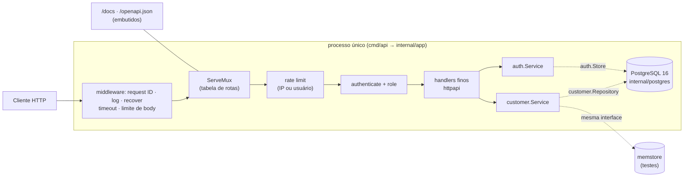
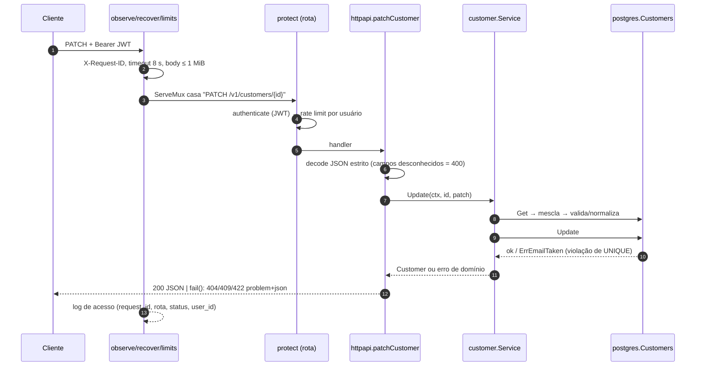

# Arquitetura

Este documento explica **como o código está organizado e por quê**, e termina com o passo a passo para adicionar um recurso.
A filosofia é a de Go: pacotes por assunto, interfaces pequenas **declaradas por quem as usa**, sem camadas cerimoniais
(decisões em [docs/adr](adr)).

## 1. Visão geral

| Pacote | Papel | Importa |
|---|---|---|
| `cmd/api` | `main`: flags, sinais, `os.Exit` | `app`, `config` |
| `internal/app` | composition root: liga tudo, `Serve` com *graceful shutdown* | todos |
| `internal/config` | variáveis de ambiente → `Config`; recusa segredo fraco em `release` | — |
| `internal/customer` | modelo, validação (CPF/CNPJ…), `Service`, `Repository` | `validation` |
| `internal/auth` | usuários, bcrypt, JWT, refresh com rotação, `Store` | `validation` |
| `internal/httpapi` | rotas, middleware, JSON, RFC 9457, OpenAPI + Swagger UI | `customer`, `auth`, `ratelimit` |
| `internal/postgres` | `pgx`, migrations embutidas, implementa `Repository`/`Store` | `customer`, `auth` |
| `internal/memstore` | implementações em memória (testes) | `customer`, `auth` |
| `internal/ratelimit` | token bucket em memória | — |
| `internal/validation` | `Errors` (campo + mensagem), e-mail, dígitos | — |
| `internal/repotest`, `internal/testdb` | suíte de contrato compartilhada; schema isolado por teste | — |

**Regra de dependência:** `customer` e `auth` (o núcleo) não importam `httpapi`, `postgres` nem `pgx`. `httpapi` não
importa `postgres`. Só `app` conhece todos. O compilador já recusa ciclos.

## 2. Fluxo de uma requisição

`PATCH /v1/customers/{id}` por um `user`:

### Erros (RFC 9457)

Todo erro é `application/problem+json` com `type: "about:blank"`, `title`, `status`, `detail`, `code` (estável, para
máquinas), `request_id` e, em 422, `errors: [{field, message}]`. O mapa erro → HTTP vive em **um** lugar
(`httpapi/problem.go`, `fail`):

| Situação | Status | `code` |
|---|---|---|
| JSON malformado / campo desconhecido / dado extra | 400 | `invalid_json` |
| Sem token / token inválido ou expirado | 401 | `missing_token` · `invalid_token` · `invalid_credentials` |
| Papel insuficiente (usuário comum tentando `DELETE`) | 403 | `forbidden` |
| Cliente ou rota inexistente | 404 | `customer_not_found` · `route_not_found` |
| E-mail / documento já cadastrado | 409 | `email_taken` · `document_taken` |
| Body > 1 MiB · `Content-Type` não-JSON | 413 · 415 | `body_too_large` · `unsupported_media_type` |
| Valor inválido (corpo ou query) | 422 | `validation_failed` |
| Rate limit | 429 (+ `Retry-After`) | `rate_limited` |
| Timeout / dependência fora | 503 | `timeout` · `not_ready` |
| Qualquer outro erro | 500 genérico — a causa vai só para o log | `internal_error` |

## 3. Decisões de comportamento que valem saber

- **Normalização antes de validar/gravar:** e-mail em minúsculas, CPF/CNPJ e telefone só com dígitos, UF em maiúsculas, CEP com 8
  dígitos. É isso que o índice `UNIQUE` enxerga (`C0@x.com` e `c0@x.com` são o mesmo cliente).
- **`PUT` vs `PATCH`:** `PUT` sobrescreve todos os campos graváveis (omitir `phone`/`address` os limpa). `PATCH` altera só o que veio;
  `address` enviado substitui o endereço inteiro; `null` equivale a omitir. É *read-modify-write* sem versão: vale a última escrita.
- **Id inválido** (`/v1/customers/abc`) responde `404`, igual a um id inexistente — não há motivo para distinguir.
- **Request ID:** aceita `X-Request-ID` do cliente só se for curto e seguro (`[A-Za-z0-9._-]{1,64}`); senão gera um UUID. Vai no header,
  no corpo dos erros e em todo log.
- **Shutdown:** `SIGINT/SIGTERM` → para de aceitar, espera requisições em andamento (até 10 s) e fecha o pool.
- **Healthcheck do container:** a imagem é *distroless* (sem shell/curl); o próprio binário se sonda com `/api -healthcheck`.

## 4. Como adicionar um recurso (passo a passo)

Exemplo: `products` (id, name, price_cents). Cada passo é uma mudança pequena e testável.

1. **Migration.** Crie `internal/postgres/migrations/0003_products.sql` (`CREATE TABLE products (...)`). O runner a aplica na
   próxima partida, em ordem de nome de arquivo.
2. **Domínio (teste primeiro).** Crie `internal/product/` com o tipo `Product`, `Input`, erros (`ErrNotFound`) e a validação
   (reuse `validation.Errors`). Escreva `product_test.go` com casos em tabela antes do código.
3. **Interface no consumidor.** Em `internal/product/service.go`, declare `type Repository interface { ... }` só com o que o
   `Service` usa, e implemente o `Service` (regras + normalização). Teste com um fake.
4. **Adaptadores.** `internal/memstore/products.go` (memória) e `internal/postgres/products.go` (SQL com `pgx`; traduza
   violações de `UNIQUE` para erros do domínio como em `mapCustomerErr`). Escreva a suíte de contrato em
   `internal/repotest/products.go` e chame-a dos dois pacotes — o fake fica provadamente igual ao banco.
5. **HTTP.** Em `internal/httpapi`: declare `ProductService` (interface) em `server.go`, crie `products.go` com handlers finos
   (`decode` → service → `writeJSON` / `s.fail`) e adicione as linhas na tabela `routes()` (escolhendo `Public`, `AnyUser` ou
   `AdminOnly`). Se surgir um erro de domínio novo, acrescente um `case` em `fail` (problem.go).
6. **OpenAPI.** Descreva as operações e schemas em `internal/httpapi/openapi.json`. `TestOpenAPIMatchesRouter` falha enquanto a spec
   e a tabela de rotas divergirem, e os testes HTTP falham se uma resposta real não estiver documentada.
7. **Ligação.** Em `internal/app/app.go`, construa o repositório e o serviço e passe-os em `httpapi.Deps`.
8. **Teste de ponta a ponta + gate.** Estenda `internal/httpapi/api_test.go` (fluxo com `memstore`) e rode `make test` e `make lint`;
   os gates de cobertura dizem se algo ficou sem teste (acrescente o pacote novo à lista `CORE` de `scripts/coverage-gate.sh`).

Para **proteger um recurso por papel** basta usar `AdminOnly` na tabela de rotas; para um papel novo, acrescente a constante em
`auth.Role`, aceite-a em `Authenticate` e gere a decisão em `requireRole`.
